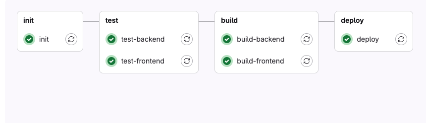

# Stages

- **Init Stage** (`ci/provider/gitlab/config/300-init.yaml`): Initializes the environment.
- **Test Stage**:
    - **Backend Tests** (`ci/provider/gitlab/config/400-test-backend.yaml`): Runs backend tests.
    - **Frontend Tests** (`ci/provider/gitlab/config/410-test-frontend.yaml`): Runs frontend tests.
- **Build Stage**:
    - **Backend Build** (`ci/provider/gitlab/config/500-build-backend.yaml`): Builds the backend.
    - **Frontend Build** (`ci/provider/gitlab/config/510-build-frontend.yaml`): Builds the frontend.
- **Deploy Stage** (`ci/provider/gitlab/config/600-deploy.yaml`): Deploys the application using Deployer.
